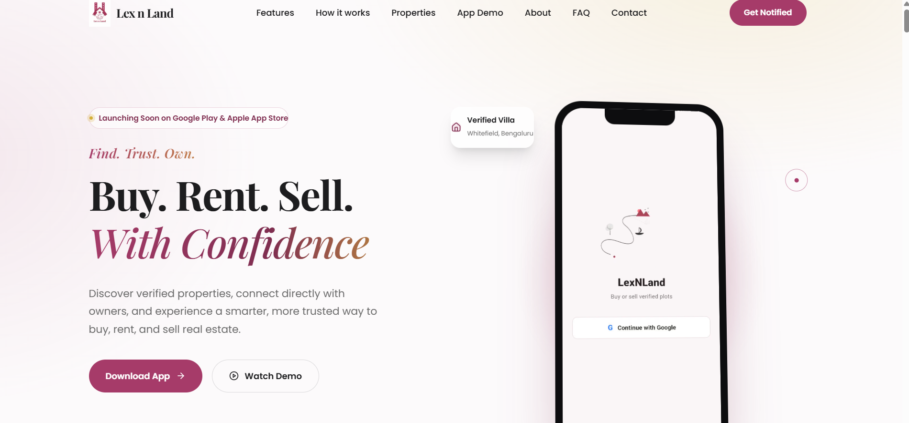
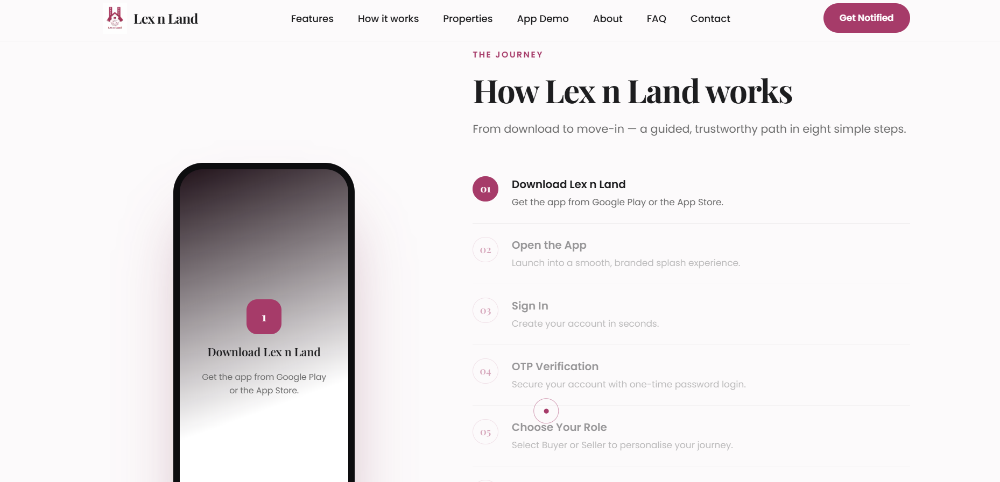
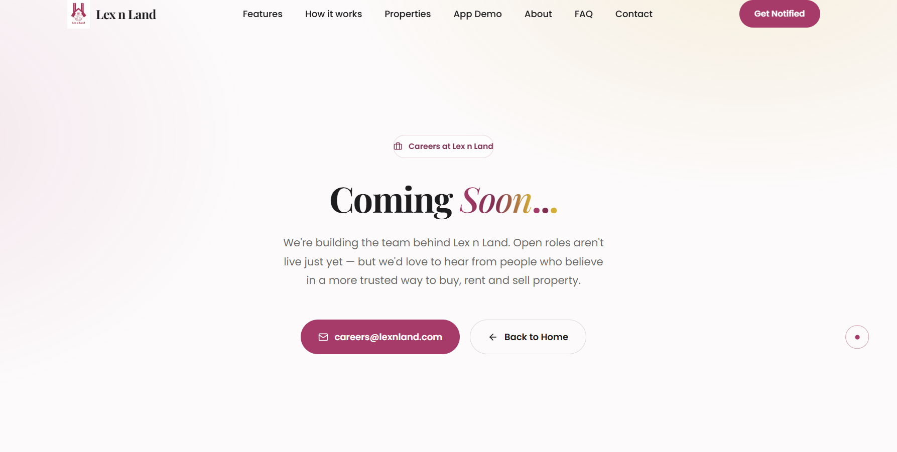

# 🏡 Lex n Land – Premium Real Estate Landing Website

> **Find. Trust. Own.**

A modern, luxurious, and high-performance landing website built for **Lex n Land**, a next-generation real estate platform that simplifies buying, renting, and selling properties through an elegant mobile-first experience.

Designed with premium aesthetics inspired by Apple, Airbnb, and modern SaaS products.

---

## ✨ Overview

Lex n Land is a real estate platform focused on creating a seamless and trustworthy property discovery experience.

This landing website serves as the official pre-launch website, showcasing the platform, highlighting its features, and encouraging users to download the mobile application once it becomes available.

---

## 🚀 Features

- 🎨 Premium Luxury UI/UX
- 📱 Interactive Mobile App Showcase
- 🎥 Embedded App Walkthrough Video
- 🏡 Buy • Rent • Sell Experience
- 🔍 Verified Property Discovery
- 💬 Direct Owner Connections
- 📍 Smart Location Search
- ❤️ Wishlist Support
- ✨ Smooth GSAP Animations
- 🎯 Responsive Design
- 🌙 Dark Mode Ready Architecture
- ⚡ Optimized Performance
- 🔒 Secure & Trustworthy Branding

---

## 🖼️ Website Sections

- Hero Section
- Launching Soon Banner
- Mobile App Showcase
- Features
- How It Works
- Why Choose Lex n Land
- Property Showcase
- App Demo
- Testimonials
- About Us
- Founder Vision
- FAQ
- Contact
- Newsletter
- Footer

---

## 🛠️ Tech Stack

- Next.js
- React
- TypeScript
- Tailwind CSS
- GSAP
- Lenis Smooth Scroll
- Lucide Icons

---

## 🎨 Design Philosophy

The website follows a premium design language inspired by luxury technology brands.

Design principles include:

- Minimalism
- Elegant Typography
- Glassmorphism
- Soft Gradients
- Micro Interactions
- Smooth Scroll Animations
- Premium Spacing
- Modern Accessibility

---

## 📱 Mobile Application

The landing page showcases the complete Lex n Land mobile application journey:

- Splash Screen
- Sign In
- OTP Authentication
- Role Selection
- Property Discovery
- Property Details
- User Profile

---

## 🚧 Project Status

**Current Status:** Pre-Launch

The website is ready while the mobile application is preparing for its official launch on Google Play.

---

## 📂 Installation

```bash
git clone https://github.com/shivani-5932/lexnland-website.git

cd lexnland-website

npm install

npm run dev
```

---

## 📸 Screenshots

### 🏠 Home



---

### ⚙️ How It Works



---

### 💼 Careers



---

## 📈 Future Roadmap

- AI Property Recommendations
- Interactive Maps
- Virtual Property Tours
- Verified Builders
- Smart Investment Insights
- iOS Application
- Admin Dashboard
- Owner Portal

---

## 🤝 Contributing

Contributions, suggestions, and feedback are always welcome.

Feel free to fork the repository and submit a pull request.

---

## 📄 License

This project is licensed under the MIT License.

---

## 👩‍💻 Developed By

**Shivani Emanuel**

Built with ❤️ for **Lex n Land**.

---

## 🌟 Support

If you like this project, consider giving it a ⭐ on GitHub!
